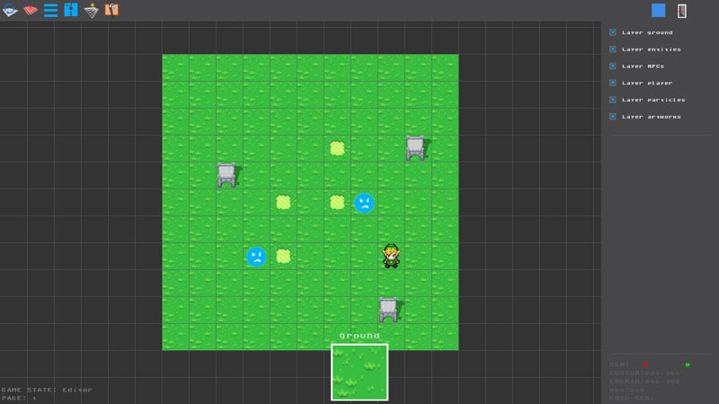
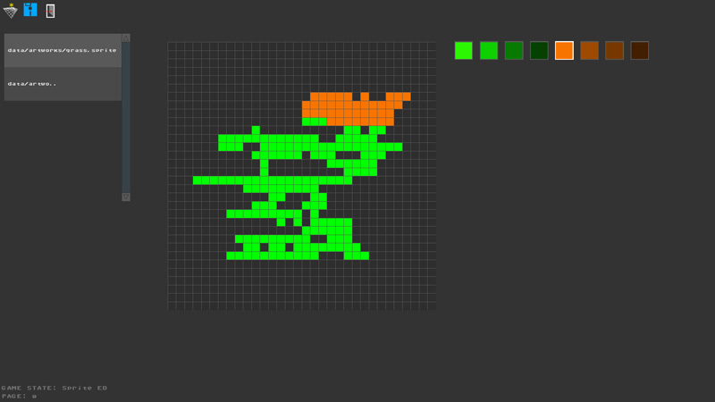

# spriteED
spriteEd is a simple open source sprite editor for FTEQW game engine released under MIT license.

<iframe width="560" height="315" src="https://www.youtube.com/embed/eAt7OgUmF-A" frameborder="0" allow="accelerometer; autoplay; encrypted-media; gyroscope; picture-in-picture" allowfullscreen></iframe>

##Features:

- entities placement
- possiblity to add top / shadow part to entities
- sprite collisions (for now just set to 32x32)
- particles animation
- 2d character frame animations
- builtin artwork editor to build your own sprite (experimental! FPS drop when too much artworks used)
- pretty solid game states for fast switch from one game state to another
- CUI embedded (craFTEr User Interface, see my other project on GithHub, Youtube) for  easy UI placementof buttons, checkbox, lists, titles, etc.

## Warning
Since is just a proof of concept (I wanted to see if it was possible to draw 2d stuff on FTE Quake engine), don't think it's a solid software: you'll need to add a lot of code to transform it into a game.
